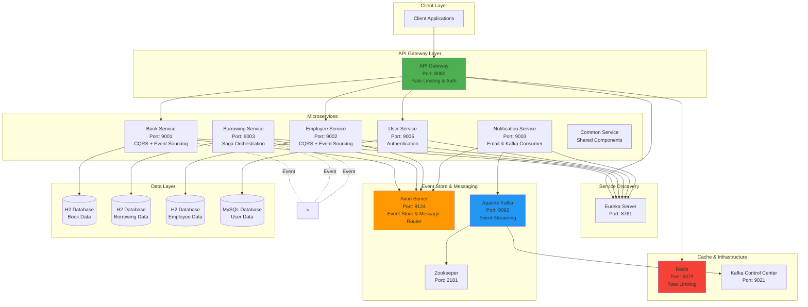

# 📚 <PROJECT_NAME> - Microservice Event Sourcing

[](https://www.java.com/) [](https://spring.io/projects/spring-boot) [](https://www.axoniq.io/) [](https://kafka.apache.org/) [](https://www.mysql.com/) [](https://redis.io/) [](https://www.docker.com/) [](https://kubernetes.io/) [](https://maven.apache.org/) [](https://www.keycloak.org/) [](https://www.postman.com/)

## 📋 Tổng Quan Dự Án

<PROJECT_DESCRIPTION>

## 🏗️ Kiến Trúc Hệ Thống



## 🎯 Tính Năng Chính

### 📖 Quản Lý Sách (Book Service)
- ✅ Tạo, cập nhật, xóa sách
- ✅ Theo dõi trạng thái sẵn sàng
- ✅ Rollback khi giao dịch thất bại

### 👥 Quản Lý Nhân Viên (Employee Service)
- ✅ CRUD nhân viên
- ✅ Kiểm tra trạng thái kỷ luật
- ✅ Kiểm tra điều kiện mượn sách

### 📝 Quản Lý Mượn Sách (Borrowing Service)
- ✅ Tạo phiếu mượn
- ✅ Saga orchestration để đảm bảo tính nhất quán
- ✅ Rollback tự động

### 🔐 Quản Lý Người Dùng (User Service)
- ✅ Xác thực, phân quyền
- ✅ Tích hợp Keycloak OAuth2/JWT

### 📧 Thông Báo (Notification Service)
- ✅ Gửi email
- ✅ Xử lý Kafka events

## 🛠️ Tech Stack

- **Spring Boot 3.x**
- **Java 17**
- **Axon Framework & Server**
- **Apache Kafka & Zookeeper**
- **MySQL / H2**
- **Keycloak**
- **Redis**
- **Docker & Docker Compose**
- **Kubernetes**

## 📦 Cấu Trúc Dự Án
```
<PROJECT_ROOT>/
├── apigateway/              # API Gateway
├── discoverserver/          # Eureka
├── bookservice/             # Book microservice
├── borrowingservice/        # Borrowing microservice
├── employeeservice/         # Employee microservice
├── userservice/             # User & Auth microservice
├── notificationservice/     # Notification microservice
└── commonservice/           # Shared components
```

## 🚀 Hướng Dẫn Chạy Dự Án

### Yêu Cầu Hệ Thống
- Java 17+, Maven, Docker & Docker Compose

### Docker Compose
```bash
git clone <repo-url>
cd <repo-dir>

docker-compose -f docker-compose-provider.yml up -d   # infra
docker-compose up -d                                # all services
```

### Local Development
```bash
# start infra
docker-compose -f docker-compose-provider.yml up -d

# start services one by one
cd discoverserver && mvn spring-boot:run
cd ../bookservice && mvn spring-boot:run
# … repeat for other services
```

## 🔗 Endpoints & Ports
| Service | Port | Description |
|---------|------|-------------|
| API Gateway | 8080 | Entry point |
| Eureka | 8761 | Service registry |
| Book Service | 9001 | CRUD sách |
| Employee Service | 9002 | CRUD nhân viên |
| Borrowing Service | 9003 | Quản lý mượn sách |
| User Service | 9005 | Auth |
| Notification Service | 9003 | Email |
| Axon Server | 8124 | Event store |
| Redis | 6379 | Rate limiting |
| Kafka | 9092 | Event streaming |

## 📚 API Docs
- Swagger UI tại `http://localhost:<gateway-port>/swagger-ui.html`
- OpenAPI JSON tại `http://localhost:<gateway-port>/v3/api-docs`

## 🔐 Security
- Keycloak realm: `<REALM_NAME>`
- JWT validation via Spring Security OAuth2 Resource Server
- Rate limiting: Redis (10 req/s, burst 20)

## 🎨 Patterns Used
- **CQRS** – tách command và query
- **Event Sourcing** – lưu lịch sử events
- **Saga** – quản lý transaction phân tán
- **API Gateway** – single entry point
- **Service Discovery** – Eureka

## 📊 Database Schema (example)
```sql
-- Book
CREATE TABLE book (id VARCHAR PRIMARY KEY, name VARCHAR, author VARCHAR, is_ready BOOLEAN);
-- Employee
CREATE TABLE employee (id VARCHAR PRIMARY KEY, first_name VARCHAR, last_name VARCHAR, is_disciplined BOOLEAN);
-- Borrowing
CREATE TABLE borrowing (id VARCHAR PRIMARY KEY, book_id VARCHAR, employee_id VARCHAR, borrowing_date DATE, return_date DATE);
```

## 🧪 Testing
- Import `KeyCloak.postman_collection.json` into Postman
- Use H2 console (`/h2-console`) for in‑memory DB inspection

## 🐳 Docker & K8s
- Each microservice has a `Dockerfile`
- Kubernetes manifests in `k8s/` directory

## 📝 Logging & Monitoring
- **Slf4j + Logback**
- **Axon Dashboard**, **Kafka Control Center**, **Eureka Dashboard**

## 🤝 Contributing
Fork, tạo branch, PR. Kiểm tra CI trước khi merge.

## 📄 License
Add your license here.

## 👨‍💻 Author
<YOUR_NAME>

---

*Template này dùng làm khởi đầu cho bất kỳ dự án microservice dựa trên Event Sourcing. Thay `<PLACEHOLDERS>` bằng thông tin dự án thực tế.*
