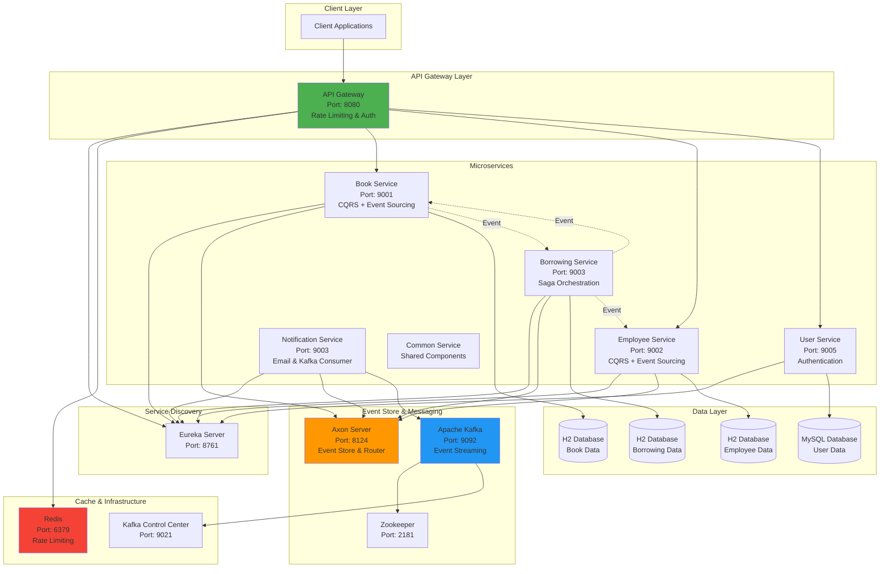

# 📚 Library Management System – Microservice Event Sourcing

[](https://www.java.com/) [](https://spring.io/projects/spring-boot) [](https://axoniq.io/) [](https://kafka.apache.org/) [](https://www.mysql.com/) [](https://redis.io/) [](https://www.docker.com/) [](https://kubernetes.io/) [](https://maven.apache.org/) [](https://www.keycloak.org/) [](https://www.postman.com/)

## 📋 Project Overview

A **library management system** built on a **microservice** architecture with **Event Sourcing**, **CQRS**, and **Saga orchestration**. The system manages books, employees, and borrowing/return workflows while guaranteeing data consistency across distributed services.

## 🏗️ System Architecture



## 🎯 Core Features

- **Book Service** – create, update, delete books; track availability; automatic state rollback on failed transactions.
- **Employee Service** – manage staff records; enforce disciplinary status for borrowing eligibility.
- **Borrowing Service** – issue borrowing requests; enforce business rules via Saga; automatic compensation on failures; audit trail for all borrow/return actions.
- **User Service** – secure authentication with Keycloak; JWT‑based authorization for protected APIs.
- **Notification Service** – email notifications triggered by Kafka events (borrow, return, overdue).

## 🛠️ Tech Stack

- **Java 17** • **Spring Boot 3.x** • **Maven**
- **Axon Framework 4.x** + **Axon Server** (Event Store, Command Bus)
- **Apache Kafka 7.x** • **Zookeeper**
- **MySQL** (persistent user data) • **H2** (in‑memory for domain services)
- **Keycloak** (OAuth2 / OpenID Connect)
- **Redis** (distributed rate limiting)
- **Docker & Docker‑Compose** (containerisation)
- **Kubernetes** (optional orchestration)
- **React 18** (frontend dashboard – not covered by this README but part of the full solution).

## 📦 Project Structure

```
eventSourcing/
├── apigateway/            # Spring Cloud Gateway with rate limiting
├── discoverserver/        # Eureka service registry
├── bookservice/           # Book microservice (CQRS + Event Sourcing)
├── borrowingservice/      # Borrowing microservice (Saga)
├── employeeservice/       # Employee microservice (CQRS)
├── userservice/           # Authentication & user management
├── notificationservice/   # Email + Kafka consumer
├── commonservice/         # Shared DTOs, events, utilities
├── docker-compose.yml     # Infrastructure definition
└── README.md              # This document
```

## 🚀 Getting Started

### Prerequisites
- **Java 17** (or newer)
- **Maven 3.6+**
- **Docker & Docker‑Compose**
- **8 GB RAM** (recommended for all services running locally)

### Run with Docker‑Compose (recommended)
```bash
# Clone repository
git clone <repo‑url>
cd eventSourcing

# Start infrastructure (Eureka, Axon, Kafka, Redis, MySQL, etc.)
docker-compose -f docker-compose-provider.yml up -d

# Start all microservices
docker-compose up -d
```
Check containers:
```bash
docker-compose ps
```
All services expose the API Gateway at `http://localhost:8080`.

### Run Locally (for development)
```bash
# Start infrastructure first
docker-compose -f docker-compose-provider.yml up -d

# Launch each service in separate terminals
cd discoverserver && mvn spring-boot:run
cd ../bookservice && mvn spring-boot:run
cd ../employeeservice && mvn spring-boot:run
cd ../borrowingservice && mvn spring-boot:run
cd ../userservice && mvn spring-boot:run
cd ../notificationservice && mvn spring-boot:run
cd ../apigateway && mvn spring-boot:run
```

## 🔗 API Endpoints & Ports

| Service | Port | Primary URL (via API Gateway) |
|--------|------|-------------------------------|
| API Gateway | 8080 | `http://localhost:8080` |
| Eureka Server | 8761 | `http://localhost:8761` |
| Book Service | 9001 | `/api/v1/books/**` |
| Employee Service | 9002 | `/api/v1/employees/**` |
| Borrowing Service | 9003 | `/api/v1/borrowing/**` |
| User Service | 9005 | `/api/v1/users/**` (protected) |
| Notification Service | 9003 | internal consumer (no external API) |
| Axon Server | 8124 | Event store (internal) |
| Redis | 6379 | Rate‑limiting (internal) |
| Kafka Broker | 9092 | Event streaming (internal) |
| Kafka Control Center | 9021 | `http://localhost:9021` |

## 📚 API Documentation
Swagger UI is auto‑generated by SpringDoc and available at:
```
http://localhost:8080/swagger-ui.html
```
OpenAPI spec (JSON) at `http://localhost:8080/v3/api-docs`.

## 🔐 Security Model

- **Keycloak** realm `ltfullstack` – handles user registration, login, role management.
- **API Gateway** validates JWT on protected routes (`/api/v1/users/**`).
- **Redis** rate limiting: 10 requests/second with burst capacity of 20.
- Service‑to‑service communication inside the mesh is trusted; internal APIs do not expose JWT checks.

## 🎨 Architectural Patterns

- **CQRS** – separate command and query models for Book, Employee, Borrowing services.
- **Event Sourcing** – all state changes persisted as immutable events in Axon Server.
- **Saga (Orchestration)** – Borrowing workflow coordinates Book and Employee services; compensating transactions roll back on failure.
- **API Gateway** – single entry point, cross‑cutting concerns (auth, rate limiting).
- **Service Discovery** – Eureka enables dynamic routing and client‑side load balancing.

## 📊 Database Schemas (illustrative)

```sql
-- Book (H2)
CREATE TABLE book (
    id VARCHAR PRIMARY KEY,
    title VARCHAR,
    author VARCHAR,
    available BOOLEAN
);

-- Employee (H2)
CREATE TABLE employee (
    id VARCHAR PRIMARY KEY,
    first_name VARCHAR,
    last_name VARCHAR,
    disciplined BOOLEAN
);

-- Borrowing (H2)
CREATE TABLE borrowing (
    id VARCHAR PRIMARY KEY,
    book_id VARCHAR,
    employee_id VARCHAR,
    borrow_date DATE,
    return_date DATE
);
```
User data lives in MySQL with standard JPA entities.

## 🧪 Testing

- **Postman collection**: `KeyCloak.postman_collection.json` (covers auth flow and core CRUD APIs).
- **H2 console**: accessible at `http://localhost:<service‑port>/h2-console` for Book, Employee, Borrowing services.
- Unit & integration tests are located under each service's `src/test/java` package and run via `mvn test`.

## 🐳 Docker & Kubernetes

Each microservice ships with its own `Dockerfile`. The `docker-compose.yml` orchestrates the complete stack. For production, Kubernetes manifests live in the `k8s/` directory (Deployments, Services, ConfigMaps, Secrets).

## 📈 Logging & Monitoring

- **SLF4J + Logback** – structured logs per service.
- **Axon Server Dashboard** – event store health.
- **Kafka Control Center** – broker metrics.
- **Eureka Dashboard** – service registration health.
- Optional: integrate Prometheus + Grafana for metrics collection.

## 🤝 Contributing

1. Fork the repository.
2. Create a feature branch.
3. Ensure `mvn test` passes.
4. Open a Pull Request.
5. CI runs lint, tests, and Docker build checks.

## 📄 License

Add appropriate license text here (e.g., MIT, Apache‑2.0).

## 👨‍💻 Author

**LTFullStack** – Udemy instructor, system architect.

---

*This README serves as a professional starter template for any microservice‑based Event‑Sourcing project. Replace placeholders with project‑specific values where needed.*
